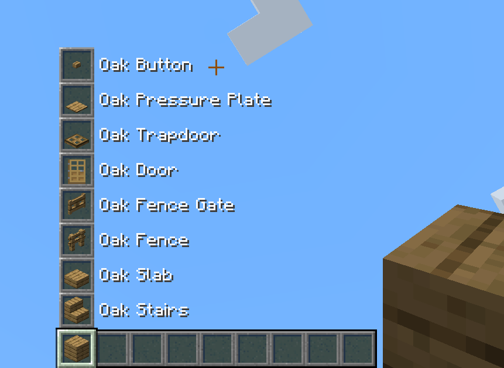
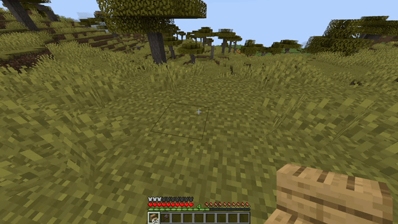

# Block Variant Swapper

A lightweight mod that lets you swap a held block between its variants - planks
to stairs, slabs, fences, doors, etc. - on the fly, without opening a crafting
table or stonecutter.

## What it does

Select a block on your hotbar, hold the **swap key** (Left Alt by default), and scroll. The block in
your hand cycles through its configured variant group. A preview appears above your hotbar showing the
other variants and their names, so you can see what you're switching to before you place it.

The core idea is that a whole "family" of blocks (for example every oak building block) behaves
like a single item you carry around and reshape as needed. For example you keep just one stack of oak planks
in your inventory, but you have 9 stacks of oak variants instantly available (full block, stair, slab, fence, fence gate,
door, trapdoor, pressure plate and button).



## Purpose

It's no secret inventory management is a huge problem in this game. One of the biggest contributors
to this problem are all the block variants that have to be added to the game for all the building blocks,
and then managing your inventory and storage of all of these blocks. With this mod block variants only
exist in the hotbar, and nowhere else; they always revert just to their original base block. This simplifies
inventory management, storage, and filtering, and eliminates the need for constantly swapping between stacks
of block variants, and crafting them in the crafting table or stonecutter.

## How it works

- **Swap:** Hold the **swap key** (Left Alt by default, rebindable) and scroll
  the mouse wheel while holding a block that belongs to a variant group. The held item changes to the
  next/previous variant. Scrolling wraps around the group.
- **Preview:** While the swap key is held, a column of "ghost" slots above your hotbar shows the other
  variants in the group, labelled by name. Distracting HUD elements are hidden while previewing.
- **Non-destructive drops:** Breaking a placed variant drops its **base** block, not the variant.
  This keeps the whole family as one interchangeable resource - place stairs, break them, get
  planks back.
- **Variants stay in the hotbar:** Variants only exist in your hotbar and offhand. Move one into
  your main inventory, a chest, a shulker, or drop it on the ground and it automatically reverts to
  its base block. This prevents variant items from cluttering storage.
- **Smart pickup:** When you pick up a base block while holding one of its variants, it merges into
  that stack instead of taking up a new slot. The stack keeps showing the variant; the count just
  goes up. (Renamed or otherwise customised stacks are kept separate.)



## Concerns and FAQs
**This causes more blocks being needed for building!**  
Not really. On average block variant crafting operations are lossy and really only with slabs you get
more blocks than original:

| Variant        | Crafting ratio | Block loss in vanilla |
|----------------|----------------|-----------------------|
| Stairs         | 6 for 4        | 33%                   |
| Slab           | 3 for 6        | 0% (you get double)   |
| Fence *        | 5 for 3        | 40%                   |
| Fence gate *   | 4 for 1        | 75%                   |
| Wall           | 6 for 6        | 0%                    |
| Door           | 6 for 3        | 50%                   |
| Trapdoor       | 6 for 2        | 67%                   |
| Pressure plate | 2 for 1        | 50%                   |
| Button         | 1 for 1        | 0%                    |
| Grate          | 4 for 4        | 0%                    |

\* Fence and fence gate also cost sticks, counted here as plank-equivalents (2 planks = 4 sticks).

This mod is always 1 block in, 1 block out, and fully reversible. So compared to vanilla crafting,
every variant except the slab actually costs *fewer* base blocks - the slab is the only case where
vanilla's 2-for-1 yield comes out ahead. For stone families you can also use the stonecutter, which
is 1:1 for most shapes, so there the two are roughly even and the mod just saves you the step.

The idea is to change the thinking about block ratios when making variants, and to stop thinking
about variants as separate blocks entirely. With this mod, variants don't exist outside of the hotbar, it's
always just the base block you're swapping to your desired shape.

**Is this client-side or server-side?**  
Both. The swap, drop-revert, and confinement all run through server-side mixins and networking,
while the swap-key + scroll trigger and ghost preview are client-side. So it needs to be installed both
on the server and the client for full function.

**Is it safe to add/remove from an existing world?**  
Very safe. The mod doesn't touch blocks placed in the world, just items in inventories.
Installing/uninstalling never corrupts a world. After installing, any block variants that are not in the player's
hotbar/offhand (but stored in storage blocks like chests, or in the internal player inventory) are reverted to the
base block. After uninstalling, every block stays where it is in the inventory - base blocks stay as base blocks,
variants in your hotbar stay as the vanilla block variants.  
The mod doesn't add or remove any item stacks or changes item stack counts, nor does it overwrite blocks placed
in the world. The only thing it does is revert block variant item stacks outside the player hotbar/offhand into the
base block item stacks. That's it.

**What about crafting recipes that use block variants?**  
Thankfully there's only a small amount of them (mainly chiseled blocks from slabs, but also things like the composter
or armour stand), and all were addressed while trying to keep crafting material balance.

**How does Creative pick-block / creative inventory work?**  
Middle-clicking a placed variant gives you the variant item (drops logic doesn't apply to creative pick), which then
works normally in the hotbar.

**How does Survival pick-block work?**  
Pick block is fully variant-aware. Middle-clicking a block will give you the item stack no matter what if it's in your
inventory and from the same block variant family. So if you pick a full block and you have a stairs variant currently
sitting on your hotbar, it will pick that item stack and auto-swap it for you. If you pick a variant block and you have
a stack of the base block in your hotbar or even inside your player inventory, it will pull it and auto-swap it as well.

**How are edge case item holders (item frames, decorated pots) handled?**  
Item frames can still display block variants if you place them into one, so no change from vanilla. The item will revert
to the base block only when punched out of the item frame. Decorated pots can also hold the variant but it will revert
when the pot is broken or removed with a hopper. Any hopper/dropper movement reverts to base block.

**Do tool enchantments still work correctly?**  
Yes, with no changes. The block reversal is handled after the game computes drops, so Silk Touch/Fortune still apply,
and then the drop results are converted to base blocks if applicable.

**Does this cause any lag or performance issues?**  
No. Block reversal check is tick-based but the scan is a cheap hashmap lookup, and only runs when an inventory UI is opened.
Impact is negligible. Game loading is microscopically faster because hundreds of crafting and stonecutting recipes for block
variants were removed.

**What about the stonecutter?**  
The stonecutter was not removed; only the recipes for block variants were removed. The block is still in the game,
retains the full block recipes (not block shape variants) and can be used for decoration or other recipes in modded
scenarios that this mod doesn't cover.

**Does/will this support mod X?**  
The list of supported mods is below. New ones can be requested by opening a GitHub issue, or added
yourself with a custom JSON config file (explanation below).

## Currently supported mods

Block families ship built in for the following. Each mod's families only become active when that mod is
actually installed, so it's always safe to have them all bundled:

- **Vanilla Minecraft** - wood sets, stone families, copper, sandstone, etc.
- **Biomes O' Plenty**
- **Oh The Biomes We've Gone**
- **Better Nether**
- **Better End**
- **Twilight Forest**
- **Deeper Darker**
- **Ecologics**
- **Regions Unexplored**

Don't see your favorite biome/building mod? Open a GitHub issue to request it, or drop in your own
config (instructions below) into your game.

## Configuration

The mod ships with built-in defaults for every supported mod above, and they stay current with each
update automatically - there are no config files to maintain unless you *want* to customize things.

These defaults live inside the mod and are never written to disk, so mod updates always bring the
latest set without you having to delete or regenerate anything. Families for a mod you don't have
installed are simply skipped.

### Customizing

To change or add variant groups, drop your own JSON file into `config/blockvariantswapper/` (the
folder is created empty for you). Any file ending in `_block_variants.json` (e.g. `minecraft_block_variants.json`) is loaded on top of the
defaults. Each file maps a base block to the list of blocks it cycles through:

```json
{
  "minecraft:oak_planks": [
    "minecraft:oak_planks",
    "minecraft:oak_stairs",
    "minecraft:oak_slab",
    "minecraft:oak_fence",
    "minecraft:oak_fence_gate",
    "minecraft:oak_door",
    "minecraft:oak_trapdoor",
    "minecraft:oak_pressure_plate",
    "minecraft:oak_button"
  ]
}
```

How your files interact with the defaults:
- **Override:** if you define a base block that already exists in the built-in defaults (e.g.
  `minecraft:oak_planks`), your group *replaces* the default one entirely, so list every variant you
  want to keep, since the default group is discarded for that block. (This is how you remove a variant
  you don't like: redefine the family without it.)
- **Add:** define a base block that isn't in the defaults to add a brand-new family; this way you can add support for
 a mod that isn't bundled yet.
- The first entry in a group is the base block that everything reverts to.
- Each base block must appear **only once per file** - a JSON file with the same key twice won't load.
- Item IDs that don't exist in the current game instance are skipped silently, so a file that
  references an optional mod is safe to keep even when that mod isn't installed.
- If two of your files define the same base block, the last one (by filename order) wins.
- Run `/reload` in-game to apply config changes without restarting.


## License

Licensed under the [LGPL-3.0-only](LICENSE) license.
